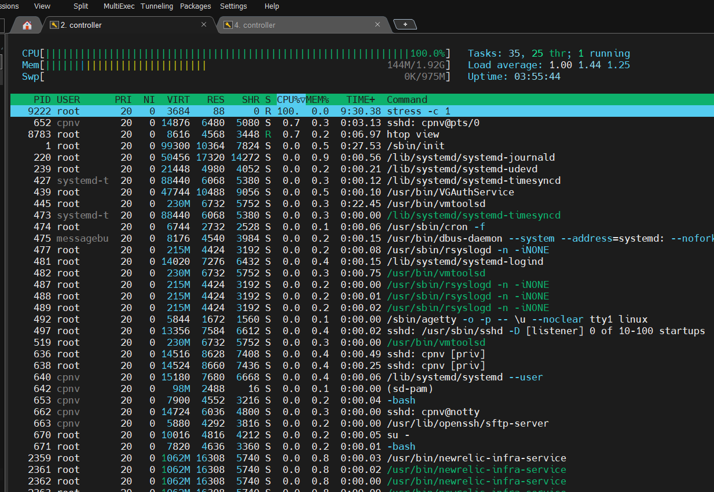

# Load testing

* [x] Add htop to your Linux vm

* [x] Add stress to your Linux vm and try to stress your cpu

<!---->

* [Stress documentation](https://www.golinuxcloud.com/stress-command-in-linux/)

<!---->

* [x] In two ssh windows, stress your vm and observe the CPU load with htop

* [x] Observer the CPU peak on NewRelic

