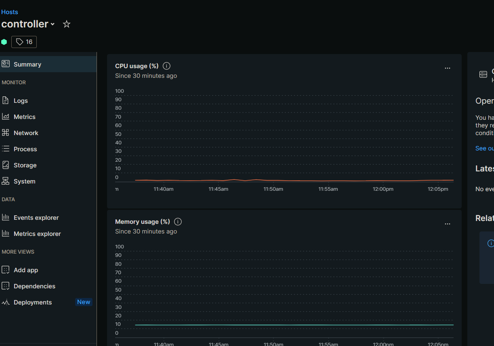
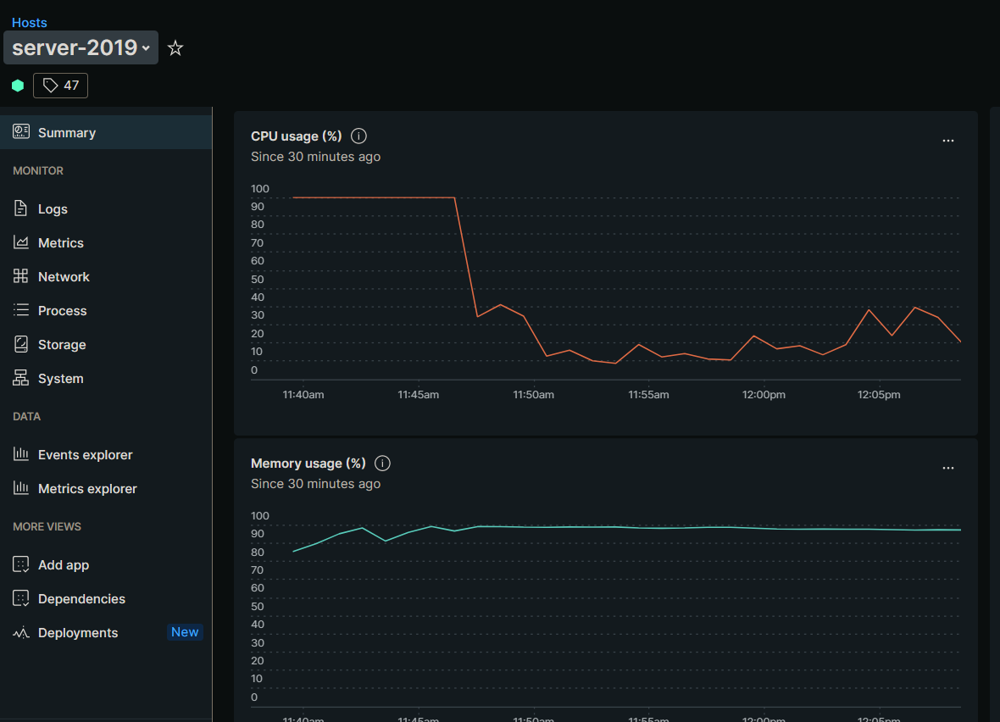
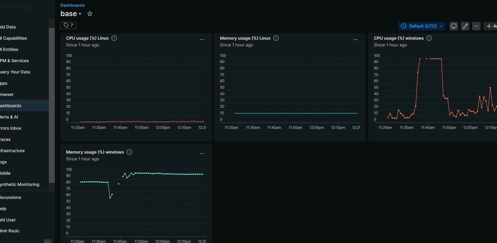

# Setup New relic clients

* [ ] Get the installation script for your OS

  installation script  for debian 11

  ```bash
  curl -Ls https://download.newrelic.com/install/newrelic-cli/scripts/install.sh | bash && sudo NEW_RELIC_API_KEY=NRAK-VKON8M22VW9LS4E0Z8FL6WS7O96 NEW_RELIC_ACCOUNT_ID=3933566 NEW_RELIC_REGION=EU /usr/local/bin/newrelic install -y
  ```

installation script for windows powershell as admin

```
[Net.ServicePointManager]::SecurityProtocol = 'tls12, tls'; $WebClient = New-Object System.Net.WebClient; $WebClient.DownloadFile("https://download.newrelic.com/install/newrelic-cli/scripts/install.ps1", "$env:TEMP\install.ps1"); & PowerShell.exe -ExecutionPolicy Bypass -File $env:TEMP\install.ps1;   $env:NEW_RELIC_API_KEY='NRAK-VKON8M22VW9LS4E0Z8FL6WS7O96'; $env:NEW_RELIC_ACCOUNT_ID='3933566'; $env:NEW_RELIC_REGION='EU'; & 'C:\Program Files\New Relic\New Relic CLI\newrelic.exe' install
```


<figure><figcaption><p>New Relic - Setup with Guided install</p></figcaption></figure>

* [x] Generate script to deploy the monitoring agent

<figure><figcaption><p>Get Install script to deploy the newrelic agent</p></figcaption></figure>

* [x] Get the command line to launch the agent's setup

<figure><figcaption></figcaption></figure>

* [x] Run the script on your vm


* Prefer to use the sudo command with your current user as the root account
* Curl, sudo are prerequisites to be installed before running the script&#x20;


## Debian 11

```
[INPUT]
curl -Ls https://download.newrelic.com/install/newrelic-cli/scripts/install.sh | bash && sudo NEW_RELIC_API_KEY=NRAK-VKON8M22VW9LS4E0Z8FL6WS7O96 NEW_RELIC_ACCOUNT_ID=3933566 NEW_RELIC_REGION=EU /usr/local/bin/newrelic install -y

[OUTPUT]
Starting installation.
Installing New Relic CLI v0.68.4
Installing to /usr/local/bin

 _   _                 ____      _ _
| \ | | _____      __ |  _ \ ___| (_) ___
|  \| |/ _ \ \ /\ / / | |_) / _ | | |/ __|
| |\  |  __/\ V  V /  |  _ |  __| | | (__
|_| \_|\___| \_/\_/   |_| \_\___|_|_|\___|

Welcome to New Relic. Let's set up full stack observability for your environment                                                                              .
Our Data Privacy Notice: https://newrelic.com/termsandconditions/services-notice                                                                              s

✔ Connecting to New Relic Platform
   Connected


Installing New Relic

✔ Installing Infrastructure Agent
   Installed

✔ Installing Golden Signal Alerts
   Installed

  New Relic installation complete

  --------------------
  Installation Summary

  ✔  Golden Signal Alerts  (installed)
  ✔  Infrastructure Agent  (installed)

  View your data at the link below:
  ⮕  https://onenr.io/07j9apPMmjO

  --------------------

  New Relic installation complete
```

* [x] Install Golden Signal Alerts and the Agent

```bash
--------------------
  Installation Summary

  ✔  Golden Signal Alerts  (installed)
  ✔  Infrastructure Agent  (installed)

  View your data at the link below:
  ⮕  https://onenr.io/07j9apPMmjO

  --------------------
```

## Windows server

```

 _   _                 ____      _ _
| \ | | _____      __ |  _ \ ___| (_) ___
|  \| |/ _ \ \ /\ / / | |_) / _ | | |/ __|
| |\  |  __/\ V  V /  |  _ |  __| | | (__
|_| \_|\___| \_/\_/   |_| \_\___|_|_|\___|

Welcome to New Relic. Let's set up full stack observability for your environment.
Our Data Privacy Notice: https://newrelic.com/termsandconditions/services-notices

✔ Connecting to New Relic Platform
   Connected


Installing New Relic

==> Installing Infrastructure Agent
New Relic infrastructure agent for Windows installed and started
Agent status check ok.
Infra key: server-2019.jubil1.local
✔ Installing Infrastructure Agent
   Installed

==> Installing Logs Integration
✔ Installing Logs Integration
   Installed

We've detected additional monitoring that can be configured by installing the following:
  .NET Agent

? Continue installing?  Yes

==> Installing .NET Agent

================================================================================
=                                                                              =
=                                   Warning                                    =
=                                                                              =
=       This installation will automatically restart IIS upon completion.      =
=                                                                              =
================================================================================

If you are not hosting your .NET application using IIS please see our other installation options:
https://docs.newrelic.com/docs/agents/net-agent/installation/install-net-agent-windows/.

Do you want to install the .NET Agent Y/N (default: Y)? y
Starting installation of the New Relic .NET Agent...
New Relic .NET Agent installed
New Relic .NET Agent configured
level=info msg="Sending tracer event to New Relic."
✔ Installing .NET Agent
   Installed

  New Relic installation complete
```

* [x] Install Golden Signal Alerts and the Agent

```
  --------------------
  Installation Summary

  ✔  .NET Agent  (installed)
  ✔  Infrastructure Agent  (installed)
  ✔  Logs Integration  (installed)

  View your data at the link below:
  ⮕  https://onenr.io/0bRmk4pzWQy

  View your logs at the link below:
  ⮕  https://onenr.io/0EjOXl4W9Q6

  --------------------
```

* [x] See your data (after the installation)

Debian 11



windows server



* [x] Observe the Dashboard displaying your vm's


